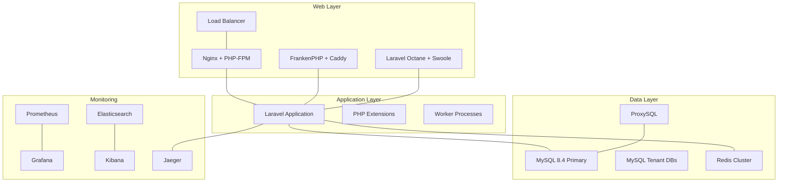

# Laravel Performance Testing Environment

A comprehensive Docker-based environment for Laravel performance testing, optimization, and analysis. This project
provides multiple web server configurations, monitoring tools, and profiling capabilities for systematic performance
analysis and benchmarking.

## Quick Start

```bash
# Clone and setup
git clone https://github.com/psrearick/customer-dashboard.git
cd customer-dashboard

# Make stack management script executable
chmod +x stack.sh

# Create configuration directory structure
./stack.sh setup

# Start traditional stack (most common)
./stack.sh up traditional -d

# Visit your application
open http://localhost
```

## Documentation

Comprehensive documentation is available in the `/docs` directory:

- **[Documentation Index](docs/README.md)** - Complete documentation overview
- **[Getting Started](docs/getting-started.md)** - Setup and first steps
- **[Stack Management](docs/stack-management.md)** - Available stacks and operations
- **[Container Reference](docs/containers.md)** - Complete container and service documentation
- **[Configuration Guide](docs/configuration.md)** - Detailed configuration reference
- **[Performance Monitoring](docs/monitoring.md)** - Monitoring and profiling tools
- **[Troubleshooting](docs/troubleshooting.md)** - Common issues and solutions

## Available Stacks

| Stack           | Components                 | Use Case                                | Port           |
|-----------------|----------------------------|-----------------------------------------|----------------|
| **traditional** | Nginx + PHP-FPM            | Most common production setup            | 80             |
| **frankenphp**  | FrankenPHP + Caddy         | Modern HTTP/3 with worker mode          | 8080           |
| **octane**      | Laravel Octane + Swoole    | High-performance long-running processes | 8000           |
| **performance** | Traditional + monitoring   | Performance testing with metrics        | 80             |
| **enterprise**  | Full stack + multi-tenancy | Enterprise features and analysis        | 80             |
| **comparison**  | All web servers            | Benchmarking different configurations   | 80, 8000, 8080 |
| **full**        | Everything enabled         | Complete testing environment            | Multiple       |

## Stack Management

```bash
# Validation
./stack.sh validate traditional     # Check configuration files

# Stack operations  
./stack.sh up performance -d        # Start with background mode
./stack.sh down enterprise          # Stop specific stack
./stack.sh restart frankenphp       # Restart stack
./stack.sh logs octane              # View logs

# System management
./stack.sh status                   # Show running containers
./stack.sh stop-all                 # Stop all project containers
./stack.sh clean                    # Remove all containers/volumes
./stack.sh list                     # List available stacks
```

## Monitoring & Tools

Once your stack is running, access these tools:

- **Application**: http://localhost (port varies by stack)
- **Grafana Dashboard**: http://localhost:3000 (admin/admin)
- **Prometheus Metrics**: http://localhost:9090
- **Kibana (ELK)**: http://localhost:5601
- **Jaeger Tracing**: http://localhost:16686
- **Load Balancer**: http://localhost:8090 (full/enterprise stacks)

## Performance Testing Features

### Web Server Comparison

- **Traditional**: Nginx + PHP-FPM (industry standard)
- **Modern**: FrankenPHP with HTTP/3 and worker mode
- **High-Performance**: Laravel Octane with Swoole for async processing

### Database Performance

- **MySQL 8.4**: Latest performance features and optimizations
- **Redis 8**: Advanced caching with I/O threading
- **Multi-tenant**: Separate databases for tenant isolation testing
- **ProxySQL**: Connection pooling and query routing
- **Percona Toolkit**: Automated MySQL query analysis

### Monitoring & Profiling

- **Prometheus + Grafana**: Comprehensive metrics and dashboards
- **ELK Stack**: Elasticsearch, Kibana for log analysis
- **Jaeger**: Distributed tracing for request analysis
- **MySQL/Redis Exporters**: Database-specific metrics
- **XHProf**: Detailed PHP function profiling

## Architecture Overview



## Performance Optimization Pipeline

This environment supports systematic performance optimization:

1. **Baseline Measurement** - Intentionally poor performance for comparison
2. **Query Optimization** - N+1 query elimination and relationship loading
3. **Database Optimization** - Strategic indexing and query tuning
4. **Memory Optimization** - Efficient data processing and memory usage
5. **Caching Implementation** - Multi-layer caching strategy (Redis, OPcache, HTTP)
6. **Server Optimization** - Web server and PHP configuration tuning

## Contributing

1. Fork the repository
2. Create feature branch (`git checkout -b feature/amazing-optimization`)
3. Test changes with `./stack.sh validate [stack]`
4. Commit changes (`git commit -am 'Add amazing optimization'`)
5. Push to branch (`git push origin feature/amazing-optimization`)
6. Create Pull Request

## License

This project is open-sourced software licensed under the [MIT license](LICENSE).

---

**Need Help?** Check the [troubleshooting guide](docs/troubleshooting.md)
or [open an issue](https://github.com/psrearick/customer-dashboard/issues).